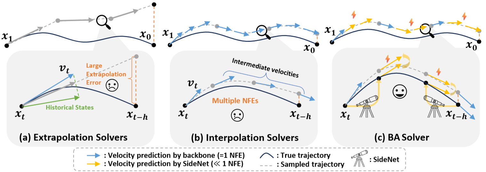

<h1 align="center"> Bi-Anchor Interpolation Solver for Accelerating <br> Generative Modeling
</h1>

[](https://arxiv.org/abs/2601.21542)&nbsp;[](https://huggingface.co/Daxuxu36/BA-solver-SideNet)

<!-- [] -->

<div align="center">
  <a href="https://ustcchx.github.io/" target="_blank">Hongxu&nbsp;Chen</a><sup>1</sup> &ensp; <b>&middot;</b> &ensp;<a href="https://lihx-me.github.io/" target="_blank">Hongxiang&nbsp;Li</a><sup>1</sup> &ensp; <b>&middot;</b> &ensp;<a href="https://scholar.google.com/citations?user=eQ-G_bQAAAAJ&hl=zh-CN" target="_blank">Wang&nbsp;Zhen</a><sup>1</sup> &ensp; <b>&middot;</b> &ensp;<a href="https://zjuchenlong.github.io/" target="_blank">Long&nbsp;Chen</a><sup>1*</sup>
  <br>
  
  <sup>1</sup>Hong Kong University of Science and Technology &emsp; 
  <sup>*</sup>Corresponding Author &emsp; <br>
</div>



<b>Summary</b>: We presented the Bi-Anchor Interpolation Solver (BA-solver), a novel framework that effectively bridges the gap between computationally expensive training-free solvers and resource-intensive training-based acceleration methods. By introducing a lightweight SideNet, we endow frozen flow matching backbones with bidirectional temporal perception, enabling high-order efficient numerical integration. BA-solver achieves state-of-the-art generation quality with as few as 5 to 10 NFEs, matching the performance of standard Euler solvers requiring 100+ NFEs.

### 1. Environment setup

```bash
conda create -n BA_solver python=3.11
conda activate BA_solver
pip install -r requirements.txt
```

### 2. Dataset

#### Dataset download

The experiments for [ImageNet](https://www.kaggle.com/competitions/imagenet-object-localization-challenge/data) are provided. You can place the data that you want and can specifiy it via `--data-dir` arguments in training scripts. We didn't apply preprocessing process for extracting latent in our experiments.

### 3. Training

```bash
export WANDB_API_KEY="YOUR_API_KEY"
export WANDB_ENTITY="WANDB_ENTITY"
export WANDB_PROJECT="WANDB_PROJECT"

accelerate launch --num_processes 1 train_BA_side.py \
  --data-dir <DATA_PATH> \
  --pretrained-ckpt <PRETRAINED_MODEL_PATH> \
  --resolution 256 \
  --model SiT-XL/2 \
  --exp-name <EXP_NAME> \
  --batch-size 168 \
  --learning-rate 0.0001 \
  --SideNet-depth 4 \
  --cfg-scale 4.0 \
  --sampling-steps 1000 \
  --checkpointing-steps 1000
```
All experiments are conducted using the **SiT-XL/2** backbone. You can adjust the configuration using the following arguments:

* `--SideNet-depth`: Depth of the SideNet module.
* `--SideNet-in-channels`: Number of input channels for SideNet.
* `--SideNet-base-channels`: Base channel width for SideNet.
* `--SideNet-h-emb-dim`: Embedding dimension for the offset parameter $h$.
* `--data-dir`: Path to the ImageNet dataset directory.
* `--pretrained-ckpt`: Path to the pre-trained SiT-REPA checkpoint. You can download it [here](https://huggingface.co/kyungmnlee/DMF/tree/main).
* `--resolution`: Input image resolution (e.g., 256 or 512).


For ImageNet 512x512, please use the following script:
```bash
export WANDB_API_KEY="YOUR_API_KEY"
export WANDB_ENTITY="WANDB_ENTITY"
export WANDB_PROJECT="WANDB_PROJECT"

accelerate launch --num_processes 1 train_BA_side.py \
  --data-dir <DATA_PATH> \
  --pretrained-ckpt <PRETRAINED_MODEL_PATH> \
  --resolution 512 \
  --model SiT-XL/2 \
  --exp-name <EXP_NAME> \
  --batch-size 96 \
  --learning-rate 0.0001 \
  --SideNet-depth 8 \
  --cfg-scale 4.0 \
  --sampling-steps 1000 \
  --checkpointing-steps 1000
```


### 4. Evaluation

Utilizing trained SideNet, you can generate ImageNet-256 images (and the .npz file can be used for [ADM evaluation](https://github.com/openai/guided-diffusion/tree/main/evaluations) suite) through the following script:

```bash
torchrun --nnodes=1 --nproc_per_node=8 generate.py \
    --model SiT-XL/2 \
    --resolution 256 \
    --num-fid-samples 50000 \
    --per-proc-batch-size 32 \
    --base-ckpt <PRETRAINED_MODEL_PATH> \
    --side-ckpt <SIDENET_MODEL_PATH> \
    --SideNet-depth 4 \
    --num-steps <STEPS> \
    --sample-dir <OUTPUT_DIR> \
    --cfg-scale <CFG> \
    --cfg-interval-start <CFG_START> \
```

You can also generate ImageNet-512 images through the following script:

```bash
torchrun --nnodes=1 --nproc_per_node=8 generate.py \
    --model SiT-XL/2 \
    --resolution 512 \
    --num-fid-samples 50000 \
    --per-proc-batch-size 10 \
    --base-ckpt <PRETRAINED_MODEL_PATH> \
    --side-ckpt <SIDENET_MODEL_PATH> \
    --SideNet-depth 8 \
    --num-steps <STEPS> \
    --sample-dir <OUTPUT_DIR> \
    --cfg-scale <CFG> \
    --cfg-interval-start <CFG_START> \
```

We provided SideNet checkpoints [here](https://huggingface.co/Daxuxu36/BA-solver-SideNet) for ImageNet-256 and -512 generation.

### 5. Results
Here are some visual samples on ImageNet-512 with only 7 NFEs. 


## Acknowledgement

This code is mainly built upon [DiT](https://github.com/facebookresearch/DiT), [SiT](https://github.com/willisma/SiT), [edm2](https://github.com/NVlabs/edm2), [RCG](https://github.com/LTH14/rcg), and [REPA](https://github.com/sihyun-yu/REPA) repositories.

## BibTeX

```bibtex
@article{chen2026bi,
  title={Bi-Anchor Interpolation Solver for Accelerating Generative Modeling},
  author={Chen, Hongxu and Li, Hongxiang and Wang, Zhen and Chen, Long},
  journal={arXiv preprint arXiv:2601.21542},
  year={2026}
}
```